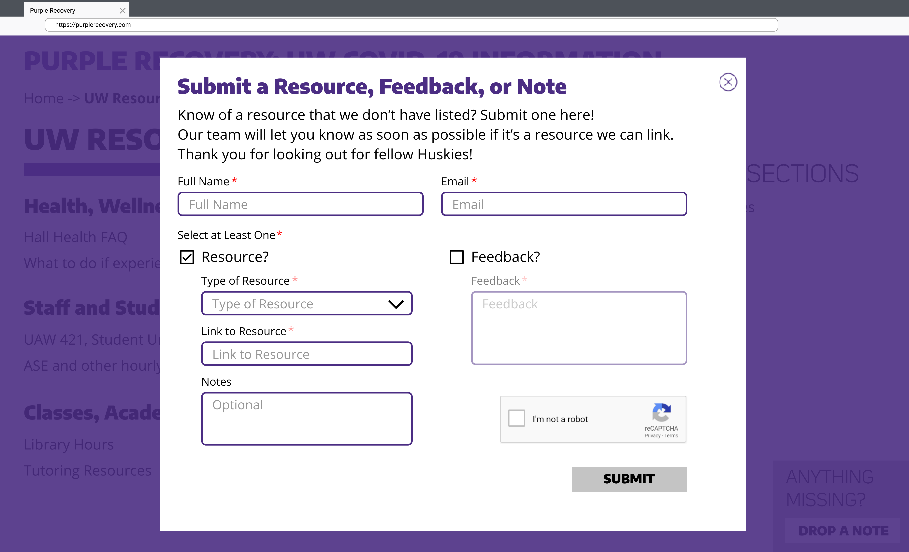
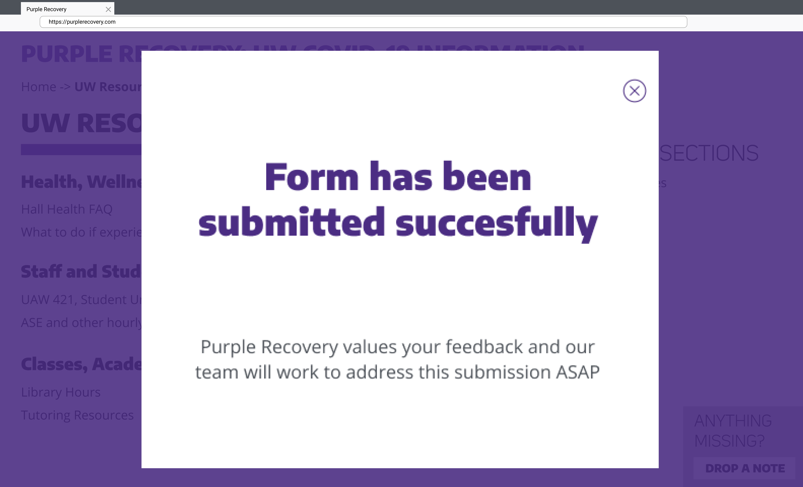

#Homework 3: Requirements 
**Purple Recovery**
------
## Glossary
* __Breadcrumb Link__: a type of secondary navigation scheme that reveals the user's location in the website relative to the Main Dashboard page.
* __Card Button__: An html card component that acts as a button to link to an external site.
* __Sticky__: fixed position on screen and always visible regardless of the user’s current scrolling position.

##Main Dashboard
* This web app will be made with HTML, CSS, JavaScript, and React.
* The web app will be accessible via Google Chrome, Firefox, and Internet Explorer.
* The colors and typography used for the web app will adhere to the UW Branding Guide.

 _Image of University of Washington Branding Guide for reference_

* The web app will be divided into these 5 sections: Resources, Responses, Community, Trackers & Dashboards, and Drop a Note. 
* Each section will be displayed as a box with content on the main page.

_Image of Main Dashboard view as a wireframe_

* Every section (excluding Trackers & Dashboards and Drop a Note) has a button to open a section’s additional information on a new page.
* The buttons to open a section’s additional information on a new Section View Page will be named accordingly: Resources - “See All”, Responses - “Find Articles”, and Community - “Stay Connected”.
* On the top left of each page, the dashboard header will contain “Purple Recovery” as a title header, and “COVID-19 Information for UW Students” as a subheader. 
* The title and subheader will be sticky on each page.  When not on the main page, clicking the title and/or subheader will bring the user back to the main dashboard page.
* On the top right of the landing page, there will be a banner displaying the title of the newest message posted along with the date posted in the Official UW COVID-19 Page under the “Messages & Updates” section. Clicking this will link to the corresponding message or update link.

##Resources
* The Resources section will be divided into two subsections as columns.
* The left column will be titled “UW FAQs” and the right column titled “Quick Links”.
* The “UW FAQs” column will contain 5 sub-sections in rows. Each will be a card buttons with the following titles: “Health, Wellness, and Prevention”, “Staff and Student Workers”, “Classes, Academics & Commencement”, “University Operations”, and “Travel and Study Abroad”. 
* Clicking any one of the 5 card buttons will redirect the user to the corresponding section on the official UW FAQ Page.
* The sub-section hyperlinks will follow this format: https://www.washington.edu/coronavirus/#[subsection name]
Where [subsection name] will be replaced with the following respective names: ‘health’, ‘staff’, ‘classes’, ‘operations’, and ‘travel’.
* The “Quick Links” section will display 6 individual hyperlinks found on the UW COVID-19 page: “CDC recommendation page”, “DOH page”, “COVID Call Center”, “UW Medicine page”, “UW Mental Health Resources”, and “Spring Quarter FAQ”.
* Each of the hyperlinks will be displayed in a list view underneath the “Quick Links” section as a text hyperlink.
* Clicking one of them will redirect the user to that resource’s external website. 

##Responses
* This section will contain links to UW-community published material (The Daily, UW Faculty Messages, UW Facebook Pages, etc.).
* The articles will be displayed as card buttons with the article title on the right and the page cover image in the article on the left (if available). 
* The Responses section will display 3 of the most recently added articles to Purple Recovery on the main dashboard page.
* The section will display a ‘Find Articles’ button in the bottom right corner that links to the Responses’ section view page.

##Community
* This section will contain links to Purple Recovery team-curated community resources.
* Each link will be displayed as a card button with the Community resource title on the right and a related icon on the left. 
* The Community section will display 3 of the most recently added community resources to Purple Recovery on the main dashboard page.
* The section will display a ‘Stay Connected’ button in the bottom right corner that links to the Community’s section view page.

##Trackers & Dashboards
* This section will contain links to data visualization dashboards regarding COVID-19 statistics. 
* The links in this section will be displayed as card buttons with the Tracker/Dashboard name on the main dashboard page. 
* There will be three card buttons:
* The first card buttons will be titled “UW COVID-19” and will link to the UW COVID-19 Testing Results page (https://www.washington.edu/coronavirus/testing-results/) .
* The second card button will be titled “King County” and will link to the King County COVID-19 data dashboard (https://www.kingcounty.gov/depts/health/communicable-diseases/disease-control/novel-coronavirus/data-dashboard.aspx)
* The third card button will be titled “Washington State” and will link to the Washington Department of Health (DOH) COVID-19 page (https://www.doh.wa.gov/emergencies/coronavirus)

##Drop a Note

_Image of Drop a Note form as a wireframe_

* On the bottom right of each page, there will be a sticky square section, containing, “Anything missing?” and a button that contains the text “Drop a Note”. 
* When clicked, the “Drop a Note” button will overlay a modal card form on top of the user’s current page position. 
* The form created from clicking “Drop a Note” will contain a card title, description, input fields, and a “Submit” button. 
* The submitted screen will have an “X” icon in the top right corner; clicking it closes the form
* The user will be able to check the “Feedback?” and “Resource?” checkboxes
* The user will be able to input string values in the “Full Name” and “Email” fields.
* The “Type of Resource” dropdown will consist of the following options: Resources, Responses, Community, Trackers and Dashboards, and Other/I’m Not Sure.
*  If the “Resource?” checkbox is clicked, the user will be able to input string values in the “Link to Resource” and “Notes” fields and use the “Type of Resource” dropdown to choose a resource type. 
* If the “Feedback?” checkbox is clicked, the user will be able to input string values in the “Feedback”  field.
* The “Submit” button will push the entered data through an internal verification process.
* The verification process is done through Javascript or React and will ensure that categories that are checked should have all fields filled in and that formatting for email is syntactically correct (i.e. example@hostsite.com).
* The verification process will also validate submitted links in Javascript.
* If the submission is found to be incomplete by this verification process, the user will be prompted to edit fields that did not pass the verification process and submit again.
* If the submission is complete and without error, a successful submission message will appear in place of the previous screen’s view.
* Clicking the top right “X” icon will close the modal sheet.

_Image of successful Drop a Note form submission as a wireframe_

##Section View Page

_Image of Response Section View Page as a wireframe_

* A section view page will be made for the following three sections: Resources, Responses, and Community.
* The section view page will contain a breadcrumb link in the top left below the site title.
* Each of the breadcrumbs will link to the respective internal page that is displayed in the list.
* The section view page will contain a title of the section that it is related to.
* The section view page will display a more comprehensive list of relevant links to its parent section from the main dashboard, as an overflow for the main page.
* All urls will be populated by developers inside of the HTML file.
* The list of relevant links will also contain a descriptive label or sentence about the links that are listed.
* The “Drop a Note” feature will stay sticky in the bottom right of the page view--the same location as the main dashboard.
* The section view page will contain links to other resources’ section view pages on the right hand side under the heading “Other Sections”.

------
